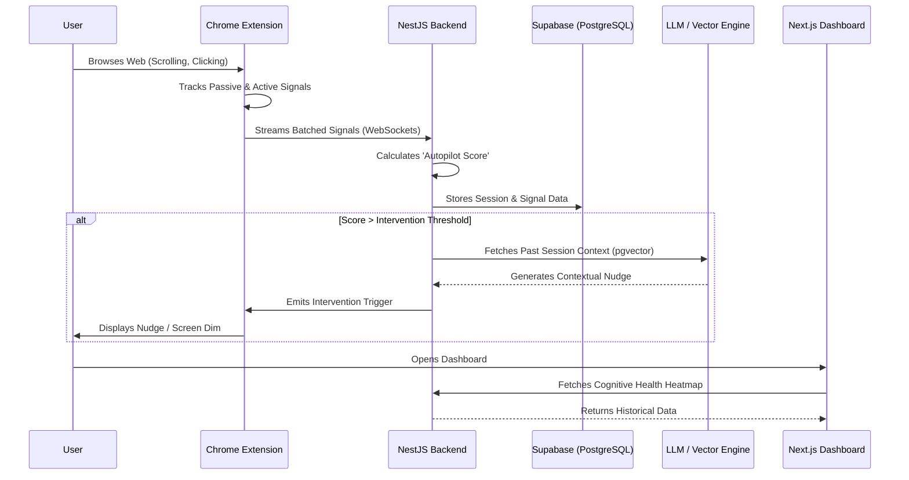

# Digital Autopilot Detector

> Breaking the loop of doomscrolling through intelligent, context-aware conscious friction.

## The Significance & Solution

**The Scenario:** Modern web experiences are optimized for infinite consumption. Users frequently fall into an "autopilot" state—mindless scrolling, rapid tab-switching, and passive consumption—losing hours of time and cognitive focus without realizing it. 

**Our Solution (The MVP):** The Digital Autopilot Detector is an end-to-end systemic approach to digital wellbeing. Instead of hard-blocking applications, it uses a Chrome Extension to passively monitor behavioral signals (scroll velocity, interaction rates, idle time, tab switching) to detect when a user has slipped into autopilot. Once detected by the NestJS backend, it introduces **conscious friction**—such as gentle nudges, screen dimming, or reflection prompts powered by Gemini and Groq AI models—forcing the user to actively re-evaluate their current digital intent.

---

## Tech Stack

This project is structured as a high-performance **Turborepo** monorepo, utilizing the following core technologies:

### Frontend & Extension
- **Web Dashboard:** [Next.js 16](https://nextjs.org/) (App Router), [React 19](https://react.dev/), Tailwind CSS, Recharts
- **Browser Extension:** Chrome Extensions API (Manifest V3), Vite

### Backend API
- **Core Framework:** [NestJS 11](https://nestjs.com/)
- **Real-Time Engine:** WebSockets (`socket.io`)
- **Job Queues:** [BullMQ](https://docs.bullmq.io/) + Redis (for asynchronous AI tasks)
- **Authentication:** Custom JWT Strategy with `argon2id` hashing

### Data & AI Layer
- **Database:** PostgreSQL hosted on [Supabase](https://supabase.com/)
- **ORM:** [Prisma](https://www.prisma.io/) (v7.8) with `@prisma/adapter-pg`
- **Vector Storage:** `pgvector` for embedding session context
- **LLM / GenAI:** Gemini (`embedding-001`) for session embeddings, Claude (Anthropic) / Groq for RAG-powered reflection interventions.

---

## System Architecture & User Flow

The system operates on a continuous feedback loop between the client extension and the real-time API.



---

### Security & Hardening (Phase 5)
- **BYOK (Bring Your Own Key):** Users can supply their own Groq API keys, which are securely encrypted at rest using **AES-256-GCM** before being stored in PostgreSQL.
- **Memory Safety & Rate Limiting:** Built-in Redis garbage collection and LRU Map caching prevent backend memory leaks. Signal batching (every ~30s) prevents database hammering.
- **Global Error Handling:** An `AllExceptionsFilter` intercepts unhandled runtime exceptions, preventing server crashes and securely masking sensitive stack traces from clients.

### User Interface (Phase 4)
- **Neo-Brutalist Aesthetics:** The web dashboard and Chrome Extension popup feature a cohesive, striking Neo-Brutalist design language (sharp borders, vibrant colors, hard shadows) to create a premium, engaging experience.
- **RAG-Powered AI Coach:** The dashboard features an interactive AI Reflection Chat. Using Gemini embeddings and pgvector, it dynamically recalls your past similar sessions to provide highly personalized, context-aware productivity coaching powered by Llama-3.

---

## Local Setup Instructions

Follow these steps to run the complete monorepo locally.

### 1. Prerequisites
- **[Bun](https://bun.sh/)** installed on your machine.
- A **PostgreSQL** database (Supabase highly recommended).
- A **Redis** server running locally or remotely (e.g., Docker `redis://localhost:6379`).

### 2. Installation
Clone the repository and install all dependencies from the `autopilot-detector` directory:
```bash
git clone https://github.com/Dealer-09/Poroshona-Kor.git
cd Poroshona-Kor/autopilot-detector
bun install
```

### 3. Environment Configuration
Navigate to the respective directories and set up your environment variables:
```bash
cp apps/api/.env.example apps/api/.env
cp apps/web/.env.example apps/web/.env.local
```
**Important:** You must populate `GEMINI_API_KEY`, `GROQ_API_KEY`, and a 32-character `ENCRYPTION_SECRET` in `apps/api/.env`.

### 4. Database Initialization
Generate the Prisma client and push the schema to your database (while inside `autopilot-detector`):
```bash
cd apps/api
bunx prisma generate
bunx prisma db push
cd ../..
```

### 5. Start the Application
Launch the entire stack from the `autopilot-detector` directory:
```bash
bun run dev
```
This command utilizes Turborepo to simultaneously start the NestJS API, Next.js Web Dashboard, and the Vite build process for the Chrome Extension in watch mode.

---

## Loading the Chrome Extension

1. Open Chrome and go to `chrome://extensions/`.
2. Enable **Developer mode** (top right corner).
3. Click **Load unpacked**.
4. Select the `apps/extension/dist` folder in this project directory.
5. You can now use the extension popup to set your intent and start a session!

---

## Future Scope

While the current version features a robust real-time engine and RAG coaching, our final vision incorporates true predictive analytics:

1. **Machine Learning Microservice:** 
   - A dedicated Python FastAPI service running **XGBoost** with GPU acceleration.
   - Will replace heuristic scores by predicting doomscroll probability based on trained datasets of real user behavioral windows.
2. **Advanced Cognitive Health Analytics:**
   - 7x24 heatmaps identifying the user's "Riskiest Hours" and "Healthiest Days".
3. **Mobile App Integration:**
   - Expanding the tracking ecosystem to native mobile platforms using React Native, utilizing screen-time APIs to aggregate mobile and desktop habits into a single cognitive profile.