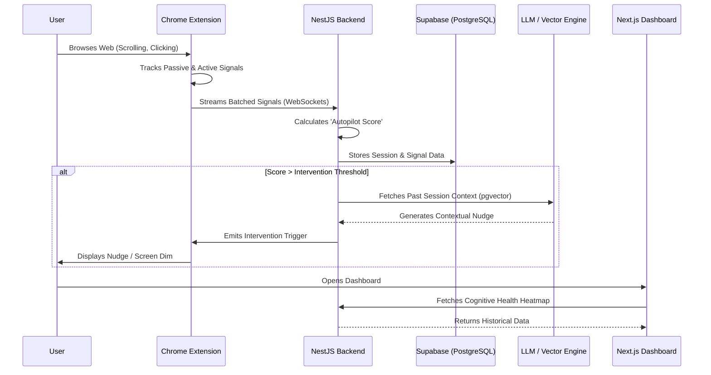

# 🧠 Digital Autopilot Detector

> Breaking the loop of doomscrolling through intelligent, context-aware conscious friction.

## 🌟 The Significance & Solution

**The Scenario:** Modern web experiences are optimized for infinite consumption. Users frequently fall into an "autopilot" state—mindless scrolling, rapid tab-switching, and passive consumption—losing hours of time and cognitive focus without realizing it. 

**Our Solution (The MVP):** The Digital Autopilot Detector is a systemic approach to digital wellbeing. Instead of hard-blocking applications, it passively monitors behavioral signals (scroll velocity, interaction rates, idle time) to detect when a user has slipped into autopilot. Once detected, it introduces **conscious friction**—such as gentle nudges, screen dimming, or reflection prompts—forcing the user to actively re-evaluate their current digital intent. 

---

## 🛠️ Tech Stack

This project is structured as a high-performance **Turborepo** monorepo, utilizing the following core technologies:

### **Frontend & Extension**
- **Web Dashboard:** [Next.js 16](https://nextjs.org/) (App Router), [React 19](https://react.dev/), Tailwind CSS, Recharts
- **Browser Extension:** Chrome Extensions API (Manifest V3), Vite

### **Backend API**
- **Core Framework:** [NestJS 11](https://nestjs.com/)
- **Real-Time Engine:** WebSockets (`socket.io`)
- **Job Queues:** [BullMQ](https://docs.bullmq.io/) + Redis (for asynchronous AI tasks)
- **Authentication:** Custom JWT Strategy with `argon2id` hashing

### **Data & AI Layer**
- **Database:** PostgreSQL hosted on [Supabase](https://supabase.com/)
- **ORM:** [Prisma](https://www.prisma.io/) (v7.8) with `@prisma/adapter-pg`
- **Vector Storage:** `pgvector` for embedding session context
- **LLM / GenAI:** Gemini (`embedding-001`) for session embeddings, Claude (Anthropic) for RAG-powered reflection interventions.

---

## 🏗️ System Architecture & User Flow

The system operates on a continuous feedback loop between the client extension and the real-time API.



---

## 💻 Local Setup Instructions

Follow these steps to run the complete monorepo locally.

### 1. Prerequisites
- **[Bun](https://bun.sh/)** installed on your machine.
- A **PostgreSQL** database (Supabase highly recommended).
- A **Redis** server running locally or remotely (e.g., `redis://localhost:6379`).

### 2. Installation
Clone the repository and install all dependencies from the root directory:
```bash
git clone https://github.com/Dealer-09/Poroshona-Kor.git
cd Poroshona-Kor/autopilot-detector
bun install
```

### 3. Environment Configuration
Navigate to the API app and set up your environment variables:
```bash
cd apps/api
cp .env.example .env
```
Update the `.env` file with your credentials:
```env
DATABASE_URL="postgresql://[USER]:[PASSWORD]@[HOST]:6543/postgres?pgbouncer=true"
DIRECT_URL="postgresql://[USER]:[PASSWORD]@[HOST]:5432/postgres"
JWT_SECRET="your_secure_secret_key"
REDIS_URL="redis://localhost:6379"
PORT=3000
```

### 4. Database Initialization
Generate the Prisma client and push the schema to your database:
```bash
# Still inside apps/api
bunx prisma generate
bunx prisma db push
```

### 5. Start the Application
Return to the root `autopilot-detector` directory and launch the entire stack:
```bash
cd ../..
bun run dev
```
This command utilizes Turborepo to simultaneously start the NestJS API, Next.js Web Dashboard, and the Vite build process for the Chrome Extension.

---

## 🚀 Future Scope (The Finale)

While the MVP relies on heuristic formulas to calculate the Autopilot Score, our final vision incorporates true predictive analytics and broader ecosystem integration:

1. **Machine Learning Microservice:** 
   - A dedicated Python FastAPI service running **XGBoost** with GPU acceleration.
   - Will replace heuristic scores by predicting doomscroll probability based on trained datasets of real user behavioral windows.
2. **AI Reflection Chat (RAG):**
   - An interactive coaching interface within the dashboard that uses `pgvector` to recall past sessions and discuss triggers with the user contextually.
3. **Advanced Cognitive Health Analytics:**
   - 7x24 heatmaps identifying the user's "Riskiest Hours" and "Healthiest Days".
4. **Mobile App Integration:**
   - Expanding the tracking ecosystem to native mobile platforms using React Native, utilizing screen-time APIs to aggregate mobile and desktop habits into a single cognitive profile.