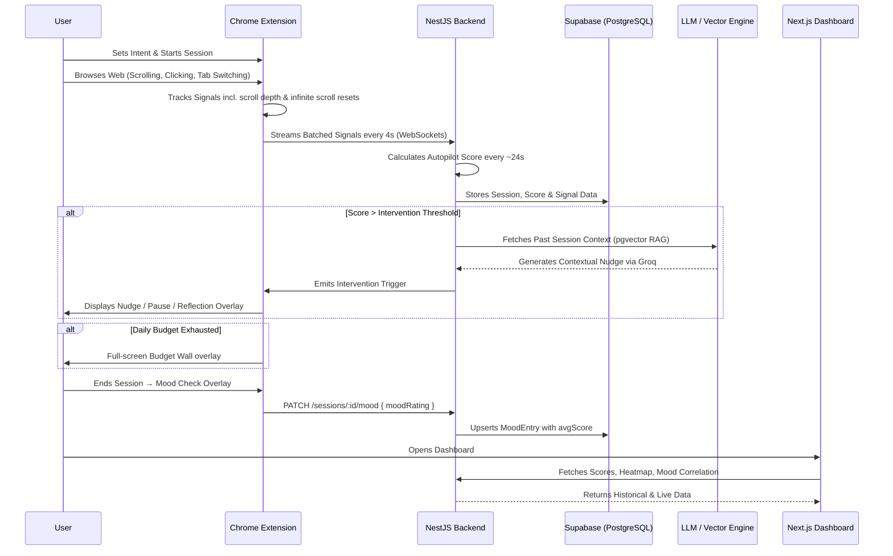

# Digital Autopilot Detector

> The algorithm is designed by a thousand engineers to steal your time.
> We built one thing to take it back.

## Live Deployment & Demo

- **Web Dashboard (Vercel):** *https://poroshona-kor.vercel.app/dashboard*
- **Chrome Extension:** Pre-compiled and ready for installation in *https://github.com/Dealer-09/poroshona-Kor/releases/tag/v0.1*.

---

## The Significance & Solution

**The Scenario:** Modern web experiences are optimized for infinite consumption. Users frequently fall into an "autopilot" state—mindless scrolling, rapid tab-switching, and passive consumption—losing hours of time and cognitive focus without realizing it.

**Our Solution:** The Digital Autopilot Detector is an end-to-end systemic approach to digital wellbeing. Instead of hard-blocking applications, it uses a Chrome Extension to passively monitor behavioral signals (scroll velocity, interaction rates, idle time, tab switching, infinite scroll depth) to detect when a user has slipped into autopilot. Once detected by the NestJS backend, it introduces **conscious friction**—gentle nudges, screen dimming, or reflection prompts powered by Groq AI—forcing the user to actively re-evaluate their current digital intent.

---

## What's New — Phase 2 Features

### 🍅 Pomodoro Focus Timer
A built-in 25-minute focus / 5-minute break cycle launched from the extension popup. During breaks, all interventions are automatically paused. Chrome badge updates to reflect the current phase.

### ⏱️ Daily Site Budgets
Set per-domain daily time limits (e.g. "30 min of YouTube per day"). When the budget is exhausted, the extension renders a full-screen overlay blocking further access. Users can override consciously. Budgets reset at midnight via a Chrome alarm.

### 😊 Post-Session Mood Tracking
After every session ends, the extension shows a mood check overlay (1–5 scale: Drained → Energized). Ratings are persisted as `MoodEntry` records and correlated with average autopilot scores. The dashboard's **Mood × Drift** chart visualises the emotional cost of autopilot sessions over time.

### 📜 Infinite Scroll (Doomscroll) Detection
The content script now tracks `scrollDepthPercent` (how far down the page the user has scrolled) and `pageResetCount` (how many times the scroll position reset to near-zero, indicating an infinite feed reload). These signals feed directly into the `doomscrollProbability` sub-score.

### 😴 Passive Intent Mode
A new `PASSIVE` session intent signals deliberate low-effort browsing. In Passive mode the scoring pipeline still runs but the intervention engine is restricted to `NUDGE`-only — no `PAUSE`, `REFLECTION`, or `SLEEP_MODE` overlays are triggered.

---

## Tech Stack

This project is structured as a high-performance **Turborepo** monorepo, utilizing the following core technologies:

### Frontend & Extension
- **Web Dashboard:** [Next.js 16](https://nextjs.org/) (App Router), [React 19](https://react.dev/), Tailwind CSS, Recharts
- **Browser Extension:** Chrome Extensions API (Manifest V3), TypeScript, Vite

### Backend API
- **Core Framework:** [NestJS 11](https://nestjs.com/)
- **Real-Time Engine:** WebSockets (`socket.io`)
- **Job Queues:** [BullMQ](https://docs.bullmq.io/) + Redis (for asynchronous AI tasks and cooldown enforcement)
- **Authentication:** Custom JWT Strategy with `argon2id` hashing

### Data & AI Layer
- **Database:** PostgreSQL hosted on [Supabase](https://supabase.com/)
- **ORM:** [Prisma](https://www.prisma.io/) (v7.8) with `@prisma/adapter-pg`
- **Vector Storage:** `pgvector` for embedding session context
- **LLM / GenAI:** Gemini (`embedding-001`) for session embeddings, Groq (Llama-3) for AI classification and RAG-powered reflection interventions

---

## The Biggest Technical Challenge We Solved

**Our biggest challenge was processing high-frequency behavioral telemetry (scrolling, tab-switching) without overwhelming our AI APIs or lagging the user's browser.**

We solved this using a custom WebSocket architecture backed by Redis. Instead of constant AI pings, we built a rolling data buffer that aggregates browser signals and offloads heavy LLM classification to background BullMQ workers in optimized 30-second batches. This avoids rate limits while ensuring zero latency for the user.

---

## System Architecture & User Flow

The system operates on a continuous feedback loop between the client extension and the real-time API.



---

### Security & Hardening
- **BYOK (Bring Your Own Key):** Users can supply their own Groq API keys, which are securely encrypted at rest using **AES-256-GCM** before being stored in PostgreSQL.
- **Memory Safety & Rate Limiting:** Built-in Redis garbage collection and LRU Map caching prevent backend memory leaks. Signal batching (every ~30s) prevents database hammering. Intervention cooldowns enforced via Redis TTL keys.
- **Global Error Handling:** An `AllExceptionsFilter` intercepts unhandled runtime exceptions, preventing server crashes and securely masking sensitive stack traces from clients.

### User Interface
- **Neo-Brutalist Aesthetics:** The web dashboard and Chrome Extension popup feature a cohesive, striking Neo-Brutalist design language (sharp borders, vibrant colors, hard shadows).
- **RAG-Powered AI Coach:** The dashboard features an interactive AI Reflection Chat. Using Gemini embeddings and pgvector, it dynamically recalls past similar sessions for highly personalized, context-aware productivity coaching.
- **Extension Popup (3-tab layout):** Intent selection, Live Dashboard (score, Pomodoro controls), and Budgets manager.

---

## Local Setup Instructions

Follow these steps to run the complete monorepo locally.

### 1. Prerequisites
- **[Bun](https://bun.sh/)** installed on your machine.
- A **PostgreSQL** database (Supabase highly recommended).
- A **Redis** server running locally (Docker recommended):
  ```bash
  docker run --name local-redis -p 6379:6379 -d redis:alpine
  ```

### 2. Installation
Clone the repository and install all dependencies from the `autopilot-detector` directory:
```bash
git clone https://github.com/Dealer-09/Poroshona-Kor.git
cd Poroshona-Kor/autopilot-detector
bun install
```

### 3. Environment Configuration
```bash
cp apps/api/.env.example apps/api/.env
cp apps/web/.env.example apps/web/.env.local
```

**`apps/api/.env` required variables:**
- `DATABASE_URL` — your PostgreSQL connection string
- `JWT_SECRET` — any long random string
- `REDIS_URL` — `redis://localhost:6379`
- `ENCRYPTION_SECRET` — exactly 32 characters (for BYOK key encryption)
- `GEMINI_API_KEY` / `GROQ_API_KEY` — optional server-side fallbacks

**`apps/web/.env` required variables:**
- `NEXT_PUBLIC_API_URL=http://localhost:3001`
- `NEXT_PUBLIC_WS_URL=ws://localhost:3001`
- `API_URL=http://localhost:3001` ← required for server-side fetches

### 4. Database Initialization
```bash
cd apps/api
bunx prisma generate
bunx prisma db push
cd ../..
```

### 5. Start the Application
```bash
bun run dev
```
This command utilizes Turborepo to simultaneously start the NestJS API, Next.js Web Dashboard, and the Vite build process for the Chrome Extension in watch mode.

---

## Loading the Chrome Extension

1. Build the extension: `bun --filter @autopilot/extension build`
2. Open Chrome and go to `chrome://extensions/`
3. Enable **Developer mode** (top right corner)
4. Click **Load unpacked**
5. Select the `apps/extension/dist` folder
6. **Log into the Web Dashboard first** — your auth token will automatically bridge to the extension
7. Open the extension popup, set your intent, and start a session

---

## Future Scope

1. **Machine Learning Microservice:**
   - A dedicated Python FastAPI service running **XGBoost** with GPU acceleration.
   - Will replace heuristic scores by predicting doomscroll probability based on trained datasets of real user behavioral windows.
2. **Advanced Cognitive Health Analytics:**
   - 7×24 heatmaps identifying the user's "Riskiest Hours" and "Healthiest Days".
3. **Mobile App Integration:**
   - Expanding the tracking ecosystem to native mobile platforms using React Native, utilizing screen-time APIs to aggregate mobile and desktop habits into a single cognitive profile.
